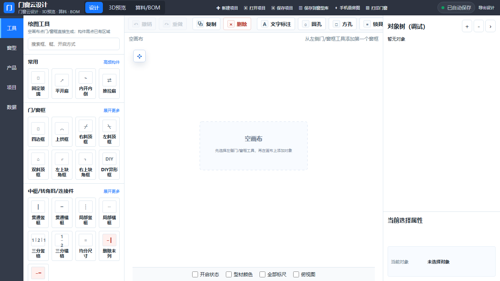
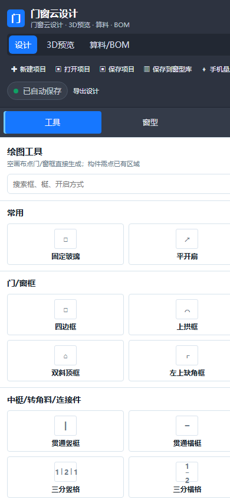
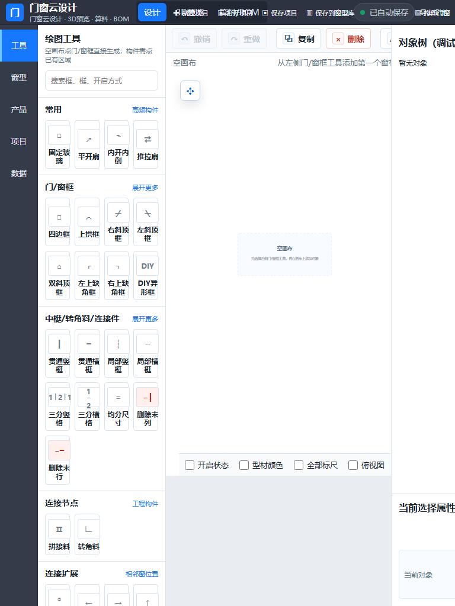

# 原型迁移基线

文档版本：0.1.0  
基线日期：2026-09-17  
状态：M0已启动，运行基线已固化，业务样本仍在补充

## 1. 源代码基线

| 项目 | 记录 |
| --- | --- |
| 原型目录 | `E:\doorMES_v1\luck_door` |
| 正式项目目录 | `E:\doorMES_v1\DoorMes` |
| 原型分支 | `main` |
| 原型提交 | `8f903d6525cd4c61f1e88bbf500363e3658bb9f7` |
| 提交时间 | 2026-09-16 20:38:42 +08:00 |
| 原型工作区 | 基线采集时无未提交变更 |

本次迁移以该提交作为首个严格一致性参照。原型后续如继续修改，必须登记新的基线提交并说明是否需要回迁。

## 2. 运行环境

| 项目 | 版本/方式 |
| --- | --- |
| Node.js | 24.16.0 |
| Python静态服务器 | 3.12.7，仅用于提供原型静态文件 |
| Chrome | 152.0.7977.83 |
| Edge | 153.0.4234.32 |
| Three.js | r160，原型本地vendor文件 |
| 原型入口 | `dist/index.html` |
| 启动方式 | 在原型目录执行 `python -m http.server 4173 --directory dist` |

正式项目不会把Python静态服务作为生产架构的一部分。

## 3. 当前规模

| 指标 | 数量 |
| --- | ---: |
| `index.html`行数 | 1,438 |
| `app.js`行数 | 16,150 |
| `app.css`行数 | 4,735 |
| HTML ID | 444 |
| 按钮 | 238 |
| 原生`dialog` | 13 |
| 命名函数 | 717 |
| 直接事件监听 | 118 |
| CSS媒体查询 | 2 |

以上数据说明正式迁移必须先拆分领域、应用、渲染和交互边界，不能把单文件结构直接复制进新工程。

## 4. 自动测试基线

执行命令：

```text
node --test tests/*.test.mjs
```

结果：8项通过，0项失败。

| 测试 | 当前覆盖 |
| --- | --- |
| `engineering-joints.test.mjs` | 工程节点规范化、归属、BOM、界面钩子和Schema |
| `first-phase-openings.test.mjs` | 14类开启、组合、3D变换和BOM映射 |
| `global-canvas-regressions.test.mjs` | 删除、尺寸、3D、投影、全局模式和对象树 |
| `installations.test.mjs` | 包套规范化、边几何、BOM、Schema和3D安装基准 |
| `lanko-yubeijia-parity.test.mjs` | 原型外壳、连接件放置、菜单、缩放和计划覆盖 |
| `physical-global-editing.test.mjs` | 全局编辑、中梃、节点、拖拽、锁点、材料和3D显隐 |
| `topology-tools.test.mjs` | 工具边界、拓扑、局部中梃BOM和Schema |
| `window-assemblies.test.mjs` | 多窗组合、3D位置、组合BOM和Schema |

限制：这些测试主要验证模块函数、源码钩子和静态契约，不能替代真实浏览器交互、视觉回归、跨端命令一致性和完整BOM快照比较。

## 5. 初始视觉基线

### 5.1 桌面 1366 × 768



当前三栏工作台、工具库、画布、对象树和属性区作为桌面首屏参考。

### 5.2 手机 390 × 844



发现：虽然触发了小屏CSS，但页面仍以纵向堆叠桌面内容为主，长工具列表占据首屏，核心画布和属性操作不可快速到达；顶部命令区也不适合手机工作流。

### 5.3 平板 768 × 1024



发现：768px没有进入760px以下的小屏布局，三栏最小宽度超过视口，顶部命令重叠，右侧属性区域被裁切。正式项目必须使用独立移动布局壳覆盖平板和手机。

## 6. 首批基线缺口

M0后续必须补齐：

1. 典型矩形窗、异形窗、局部中梃、组合开启的设计JSON与截图。
2. 拼接、转角、多窗组合、安装包套的设计JSON与截图。
3. 对应EBOM、MBOM、下料和制造接口包快照。
4. 2D、3D和BOM完整操作录像或逐步截图。
5. 原型LocalStorage样本及导入恢复验证。
6. 已确认、已冻结、设计变更等状态转换样本。

## 7. 修改日志

| 日期 | 版本 | 修改内容 |
| --- | --- | --- |
| 2026-09-17 | 0.1.0 | 固化首个原型提交、运行环境、测试结果、代码规模和三类视口截图 |
